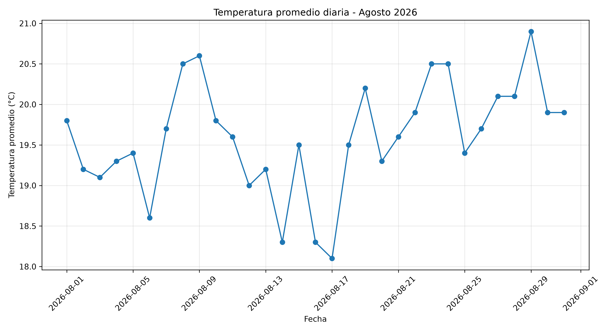
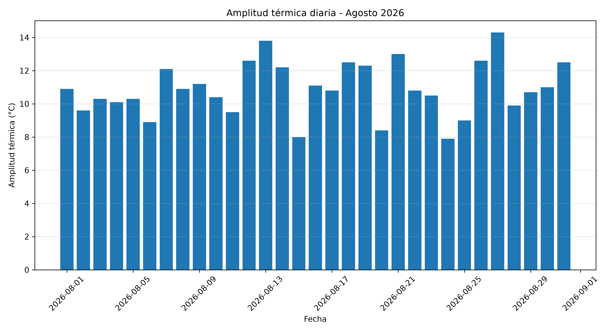
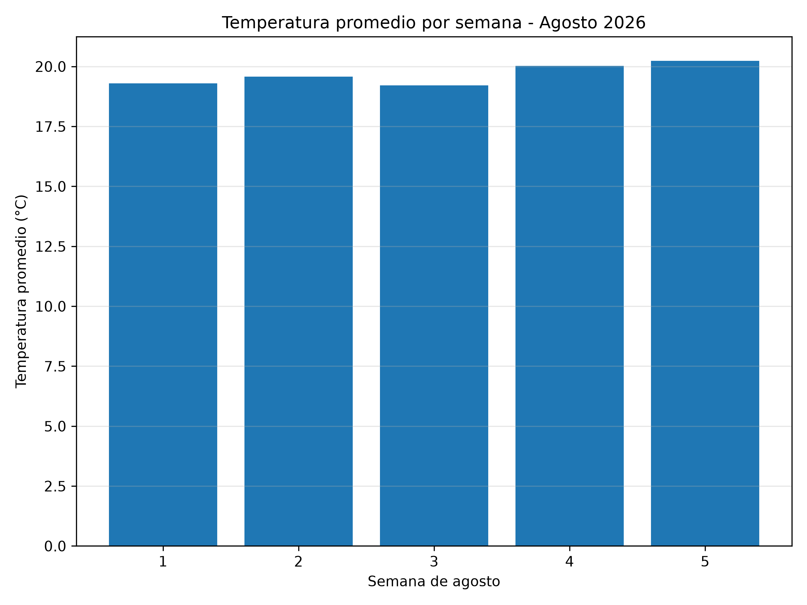
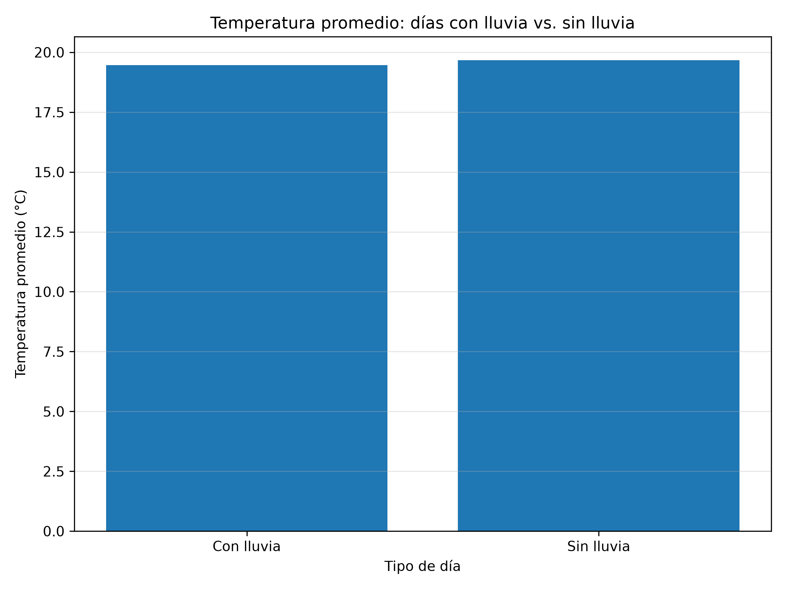
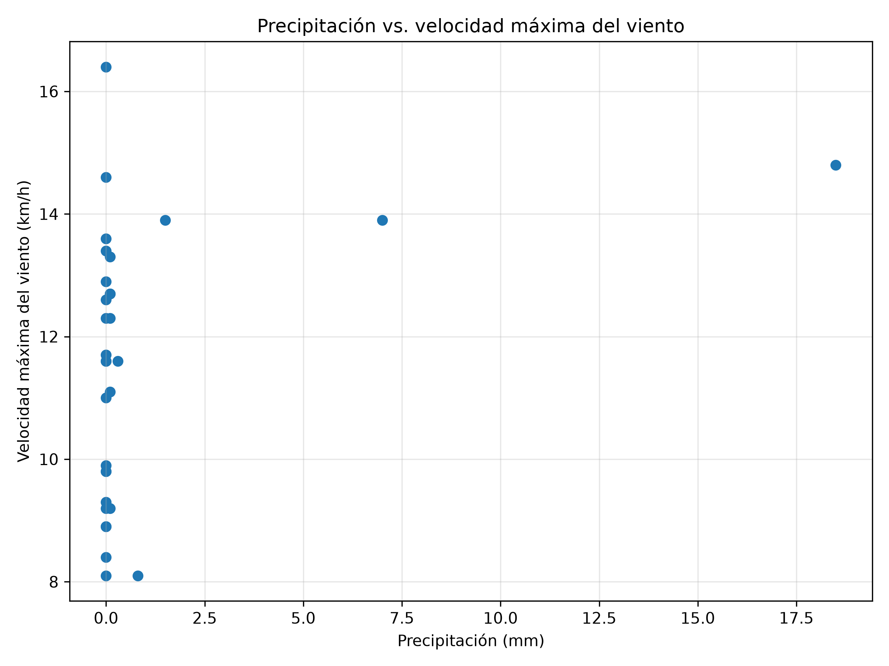

# Análisis de datos meteorológicos mediante Open-Meteo API


## Descripción

Este proyecto realiza la adquisición, almacenamiento, análisis y visualización de datos meteorológicos utilizando Python.

Los datos fueron obtenidos mediante la API histórica de Open-Meteo para las coordenadas:

- Latitud: 0.3442
- Longitud: -78.1213

El periodo analizado corresponde al mes de agosto de 2026.

El proyecto utiliza la librería Requests para consultar la API, Pandas para organizar y analizar los datos y Matplotlib para realizar las visualizaciones.


## Objetivos

- Obtener datos meteorológicos desde una API.
- Guardar los datos obtenidos en un archivo local.
- Analizar diferentes variables meteorológicas.
- Plantear y responder preguntas relacionadas con los datos.
- Crear cinco gráficas utilizando Matplotlib.
- Documentar el proyecto mediante un archivo README.md.


## Fuente de los datos

Los datos fueron obtenidos desde:

**Open-Meteo Historical Weather API**

Endpoint utilizado:

https://archive-api.open-meteo.com/v1/archive

La consulta fue configurada directamente desde la página de Open-Meteo seleccionando las coordenadas, el periodo de estudio y las variables meteorológicas.


## Periodo analizado

- Fecha inicial: 2026-08-01
- Fecha final: 2026-08-31


## Variables utilizadas

Las variables meteorológicas seleccionadas fueron:

- Temperatura media diaria a 2 metros.
- Temperatura máxima diaria a 2 metros.
- Temperatura mínima diaria a 2 metros.
- Precipitación acumulada diaria.
- Velocidad máxima diaria del viento a 10 metros.


## Tecnologías y librerías utilizadas

- Python
- Requests
- Pandas
- Matplotlib
- Open-Meteo API
- GitHub


## Proceso realizado

El desarrollo del proyecto siguió las siguientes etapas:

1. Se ingresó a la página de Open-Meteo.
2. Se seleccionaron las coordenadas del lugar de estudio.
3. Se seleccionó el periodo comprendido entre el 1 y el 31 de agosto de 2026.
4. Se seleccionaron las variables meteorológicas necesarias.
5. Open-Meteo generó la URL correspondiente a la API.
6. Python realizó una petición HTTP GET utilizando la librería Requests.
7. Se verificó que la API respondiera correctamente mediante el código HTTP 200.
8. La respuesta JSON fue convertida a una tabla o DataFrame utilizando Pandas.
9. Los datos fueron almacenados localmente en un archivo CSV.
10. Se realizaron cálculos para contestar cuatro preguntas.
11. Se generaron cinco gráficas utilizando Matplotlib.
12. Los resultados también fueron guardados en un archivo de texto.


# Preguntas planteadas y resultados


## Pregunta 1

### ¿Qué día de agosto presentó la mayor amplitud térmica?

La amplitud térmica se calculó restando la temperatura mínima diaria de la temperatura máxima diaria.

El día que presentó la mayor amplitud térmica fue el:

**27 de agosto de 2026**

Los valores registrados fueron:

- Temperatura máxima: **28,00 °C**
- Temperatura mínima: **13,70 °C**
- Amplitud térmica: **14,30 °C**

Esto significa que el 27 de agosto fue el día que presentó la mayor diferencia entre su temperatura máxima y mínima durante el periodo analizado.


## Pregunta 2

### ¿Qué semana de agosto registró la temperatura promedio más alta?

Para realizar este análisis, agosto fue dividido de la siguiente manera:

- Semana 1: días 1 al 7.
- Semana 2: días 8 al 14.
- Semana 3: días 15 al 21.
- Semana 4: días 22 al 28.
- Semana 5: días 29 al 31.

El periodo correspondiente a la:

**Semana 5**

presentó la temperatura promedio más alta:

**20,23 °C**

Es importante considerar que la semana 5 contiene solamente tres días, mientras que las semanas anteriores contienen siete días.

Por esta razón, el resultado debe interpretarse como que el periodo comprendido entre el 29 y el 31 de agosto presentó la temperatura media más alta entre los grupos definidos para este análisis.


## Pregunta 3

### ¿Los días con lluvia tuvieron una temperatura promedio diferente a los días sin lluvia?

Los días fueron separados en dos grupos:

- Días con precipitación mayor a 0 mm.
- Días sin precipitación.

Los resultados fueron:

- Temperatura promedio en días con lluvia: **19,46 °C**
- Temperatura promedio en días sin lluvia: **19,67 °C**
- Diferencia: **-0,21 °C**

Los días con lluvia presentaron una temperatura promedio aproximadamente **0,21 °C menor** que los días sin lluvia.

La diferencia observada es pequeña, por lo que las temperaturas promedio de ambos grupos fueron bastante similares durante el periodo analizado.

Este resultado representa una comparación descriptiva y no permite afirmar que la lluvia sea la causa de la diferencia de temperatura.


## Pregunta 4

### ¿Existe relación entre la precipitación y la velocidad máxima del viento?

Para analizar la relación entre estas dos variables se calculó el coeficiente de correlación de Pearson.

El resultado obtenido fue:

**r = 0,338**

El coeficiente es positivo, lo que indica que durante el periodo estudiado existió cierta tendencia a que mayores niveles de precipitación estuvieran acompañados por mayores velocidades máximas del viento.

Sin embargo, el valor obtenido no representa una relación lineal fuerte.

Además, una correlación estadística representa una asociación entre variables y no demuestra una relación de causa y efecto.


# Visualizaciones realizadas con Matplotlib


## Gráfica 1. Temperatura promedio diaria

Esta gráfica utiliza una línea porque permite observar cómo cambia la temperatura promedio a lo largo del tiempo.




## Gráfica 2. Amplitud térmica diaria

Se utilizó una gráfica de barras para comparar la amplitud térmica registrada durante cada día del mes.




## Gráfica 3. Temperatura promedio por semana

Se utilizó una gráfica de barras para comparar la temperatura promedio de los diferentes grupos semanales definidos durante agosto.




## Gráfica 4. Temperatura promedio en días con lluvia y sin lluvia

Esta gráfica de barras permite comparar directamente la temperatura promedio de los dos grupos.




## Gráfica 5. Precipitación y velocidad máxima del viento

Se utilizó una gráfica de dispersión porque se desea analizar la posible relación entre dos variables numéricas: precipitación y velocidad máxima del viento.




# Conclusiones

El proyecto permitió obtener datos meteorológicos directamente desde una API y utilizarlos posteriormente para realizar un análisis exploratorio mediante Python.

El 27 de agosto presentó la mayor amplitud térmica del mes, con una diferencia de 14,30 °C entre la temperatura máxima y mínima.

El periodo comprendido entre el 29 y el 31 de agosto presentó la temperatura promedio más alta entre los grupos semanales definidos, alcanzando 20,23 °C.

Los días con lluvia registraron una temperatura promedio de 19,46 °C, mientras que los días sin lluvia presentaron un promedio de 19,67 °C. La diferencia de 0,21 °C fue pequeña.

Finalmente, se obtuvo una correlación de Pearson de 0,338 entre la precipitación y la velocidad máxima del viento. Esto representa una asociación positiva, aunque no fuerte, y no debe interpretarse como una relación causal.

La realización del taller permitió aplicar diferentes etapas de un proceso de análisis de datos: adquisición, transformación, almacenamiento, análisis, visualización e interpretación.


# Estructura del proyecto

```text
Taller_API_Clima/
│
├── analisis_clima.py
├── datos_clima_agosto_2026.csv
├── README.md
│
├── graficas/
│   ├── 01_temperatura_promedio.png
│   ├── 02_amplitud_termica.png
│   ├── 03_temperatura_semanal.png
│   ├── 04_lluvia_temperatura.png
│   └── 05_precipitacion_viento.png
│
└── resultados/
    └── resumen_resultados.txt
```


# Ejecución del proyecto

Para ejecutar el proyecto es necesario tener Python instalado.

Las librerías utilizadas pueden instalarse mediante:

```bash
python -m pip install requests pandas matplotlib
```

Después se debe ejecutar el archivo principal:

```bash
python analisis_clima.py
```


# Archivos generados

El proyecto genera automáticamente:

- Un archivo CSV con los datos meteorológicos.
- Cinco gráficas en formato PNG.
- Un archivo de texto con el resumen de los resultados.


# Autor

Carolina Benavides

Maestría en Ciencia de Datos
